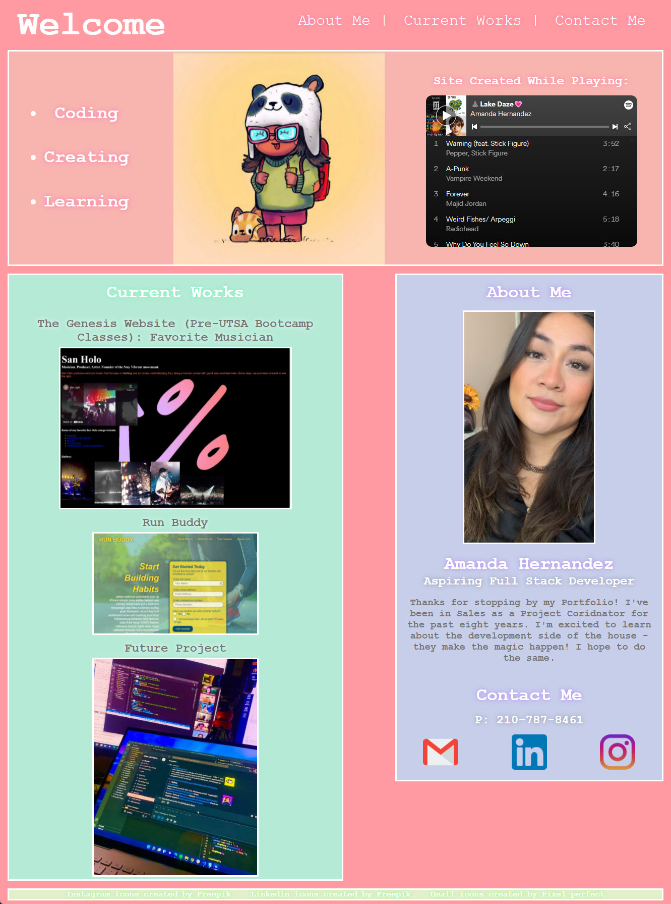

In our Week Three Challenge for the UTSA Coding Bootcamp, we were tasked with creating our first Online Portfolio - an assignment i found really fun and creative. 

There were standards to follow within the Acceptance Criteria provided as well as Grading Requirements, but the creative design was free reign. 
I tried to convey a bit of my personality through the page - and I hope that comes through for you. 

This assignment came with no `Starter Code` like our previous Challenge, so all the code was completed by me. I used: VS Studio Code, GitBash, GitHub, personal photos, a PandaF8ce character created for me by the LoveLandCrew: https://www.instagram.com/lovelandcrew/ and Icons from https://www.flaticon.com/free-icons. 

GitHub hosts all my original code. You can find that here: https://github.com/amhernandez1163/Panda-Portfolio 

GitHub also hosts the published page found here: https://amhernandez1163.github.io/Panda-Portfolio/. 

As we learn new concepts in Bootcamp, this site will be edited and updated. Can't wait to see how it transforms. But for now, enjoy!

